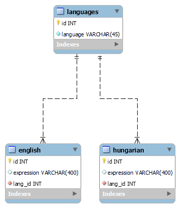

# Bare Translator

This is a interview test project, where I create a React web app for translating certain words and expressions.

## Task

The goal is to create a simple dictionary application, which is capable translating ENGLISH words or phrases into HUNGARIAN.

### Subtasks

- Create a database with a table containing the words. (dataset provided in advance)
- Create a backend application using C# .NET Core
- Create a simple React frontend application

## Technical specifications:

- Backend: **.NET Core** (ASP.NET)
- Frontend: **React**
- Chosen Relational Database Management System (RDMS): **MySQL**

## Approach to task and general process

The task is logically structured into three main parts: frontend, backend and the database. As a bottom - up approach I first started working on the database.

### Database

For the RDMS I considered _PostrgreSQL_ and _MySQL_, both of which seemed as a valid option. After some research I concluded, that PostgreSQL is more suitable for large scale and complicated use cases, so for the sake of simplicity I went with MySQL.

After setting up **MySQL 8.0** I created a local MySQL Server for hosting my database. To simulate a more real setting a virtual environment or a remote computer could hve been also used.

As the task was to create an ENGLISH to HUNGARIAN converter I created two separate tables, one for the english and one for hungarian expressions. Columns used: _id_, _expression_ and _lang_id_ as a foreign id for languages.
A third table was created for the stored languages with an _id_ and _language_ column.

#### Database related translation logic:

I created a _TranslationDAO_ class (short for Data Access Object) where I estabilished a connection with my MySQL server. MySQL.Data NuGet package was required to do so. For retrieving the data I used two queries, one to identify the id of the expression to be translated, the other one to look up the hungarian term in the _hungarian_ table.

Encountered error: as it can be seen in the hungarian table, special characters such as _ő_ and _ű_ are unsupported. After trying everything from importing .CSV with UTF-8 encoding, to setting the whole translation-schema to UTF-8 encoding and trying to import data as .JSON, MySQL failed to import data with special characters due to _charmap codec error_. Turns out it is a known bug by the community nad the developers.

### Backend

For backend I created an ASP.NET Core project with React. I added a _TranslationController_ class, which inherits from _ControllerBase_ to host the ApiController functionality. As we are only interested in retrieving simple string data, only a HttpGet request is necessary. The Get request is called from the _TranslateExpression.js_ component and calls the database access functionality implemented in _TranslationDAO.cs_.

### Frontend

The frontend side of the application consists of a single component with a TextArea for input, a button for triggering translation and another ReadOnly textarea for displaying results.

## Possible future improvements

- Creating a more sophisticated and visually appealing error handling with special components.
- With further research and knowledge I could definitely create a better logic for the databaase side of the project.
- To be able to translate to other languages as well a language selector combobox could be used and database should be expanded.
